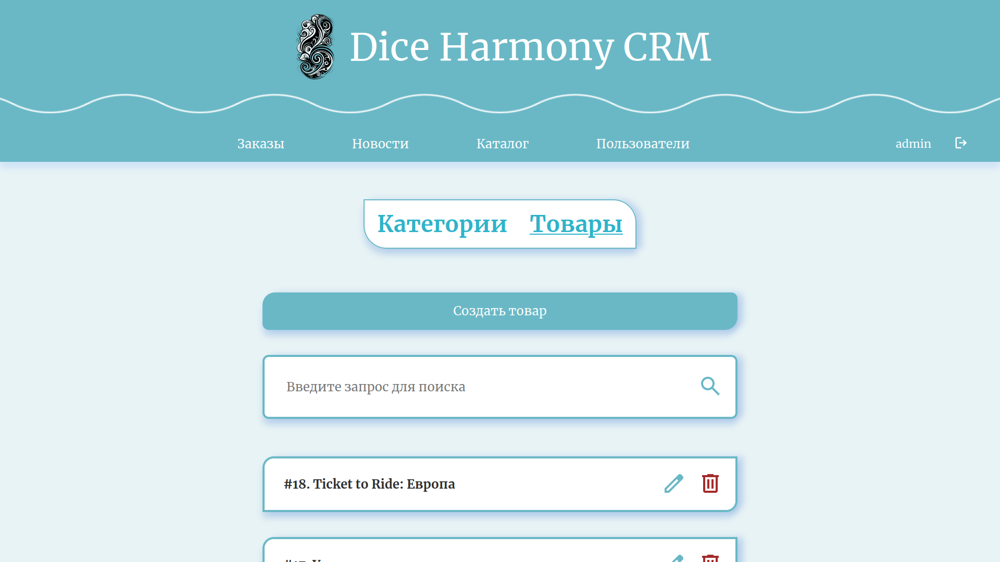

# Выпускная квалификационная работа (aka диплом)
Выпускная квалификационная работа представляет собой разработку интернет-магазина настольных игр «Dice Harmony».

<details>
<summary>Logo</summary>


</details>

## Компоненты
Интернет-магазин состоит из 3 компонентов:
- Веб-сайт, который предназначен для клиентов
- CRM, которая используется для управления различными аспектами интернет-магазина
- Telegram-бот, который позволяет быстро получать краткую информацию с веб-сайта 

## Архитектура
Архитектура интернет-магазина состоит из 3 частей: 
- Базы данных (PostgreSQL, Redis)
- Backend часть (DRF+telegram-бот)
- Frontend часть (2 React приложения: CRM + веб-сайт)

>Кроме того, используется JWT для аутентификации

<details>
<summary>Схема архитектуры</summary>


</details>

## База данных
База данных состоит из 10 таблиц. (Django ORM)

PostgreSQL является основной СУБД, а Redis используется для кеширования.

<details>
<summary>Упрощённая схема базы данных</summary>


</details>

## Запуск
Репозиторий представляет из себя моно репозиторий.
### Backend
Для запуска backend нужно:
- создать .env файл (смотри .env_example)

```bash
cp .env_example .env
```
- Запустить проект
  

<details>
<summary>Запустить через docker</summary>

```bash
docker build -t backend . && docker run -p 80:80 backend
```

</details>

<details>
<summary>Запустить вручную</summary>

- установить python 3.10 и зависимости
  
```bash
pip install -r requirements.txt
```
- сделать миграции

```bash
python manage.py makemigrations && python manage.py migrate
```
- запустить

```bash
python manage.py runserver
```

</details>

### Frontend
- установить через npm зависимости

```bash
npm init
```
- запустить crm/веб-сайт
  
```bash
npm start
```

## Скриншоты
<details>
<summary>Скриншоты веб-сайта</summary>


</details>

<details>
<summary>Скриншоты CRM</summary>





</details>

<details>
<summary>Скриншоты Telegram-бота</summary>


</details>